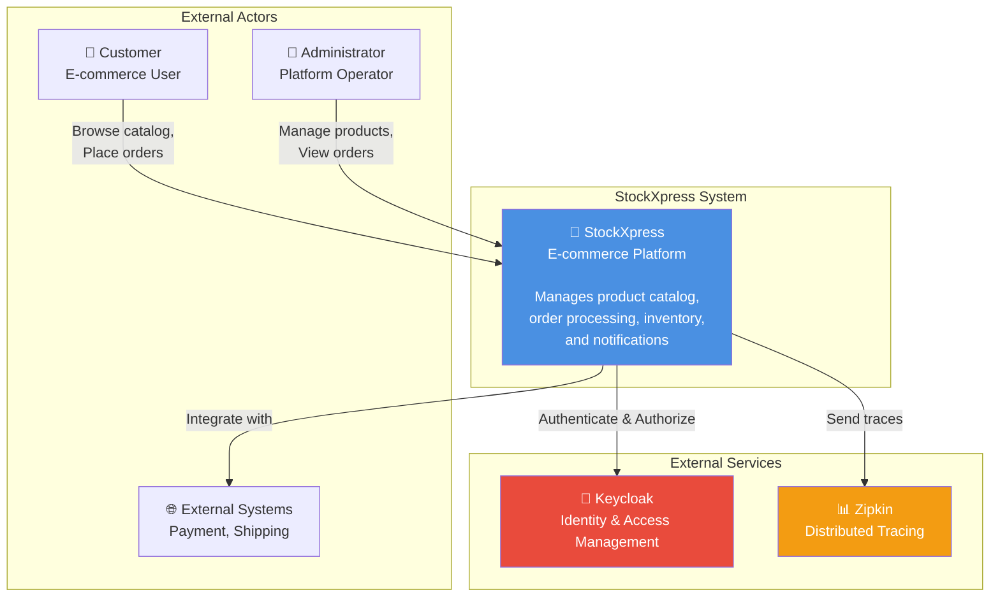
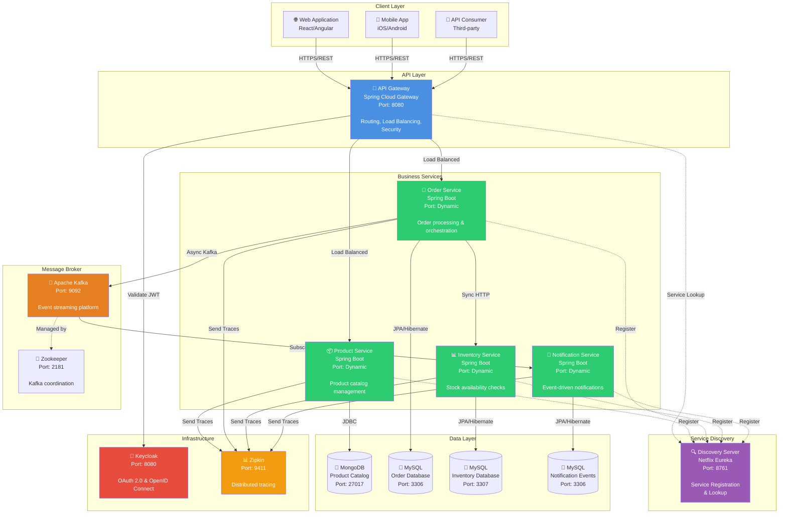
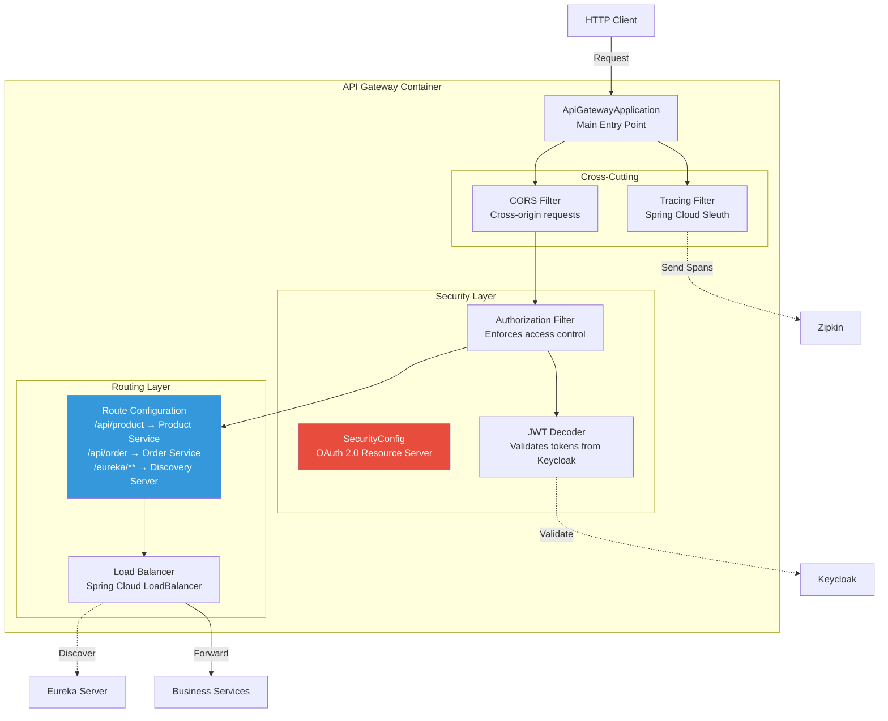
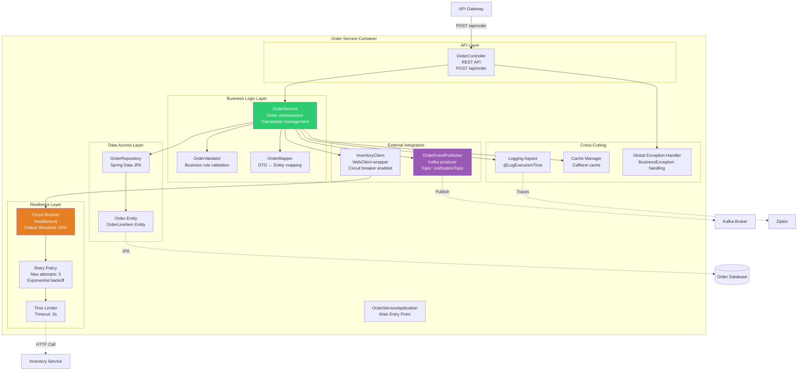
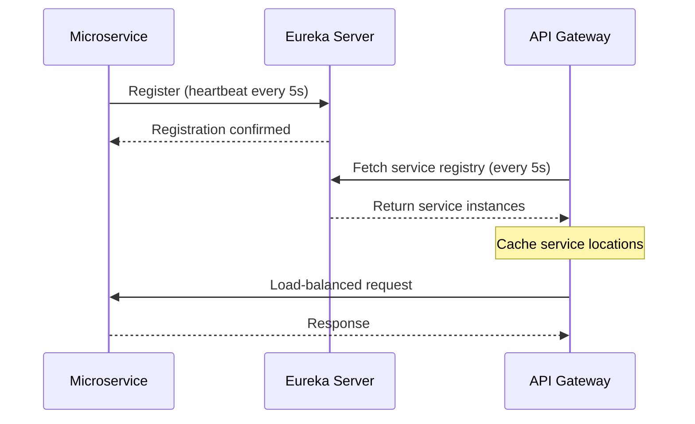
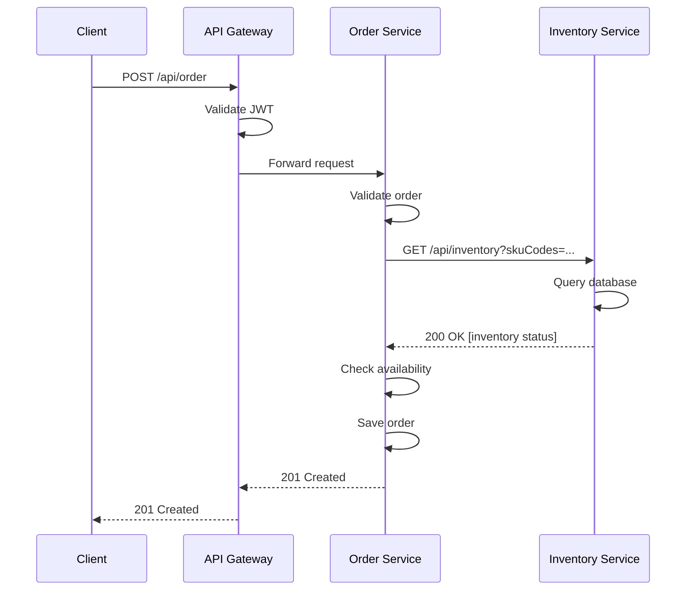
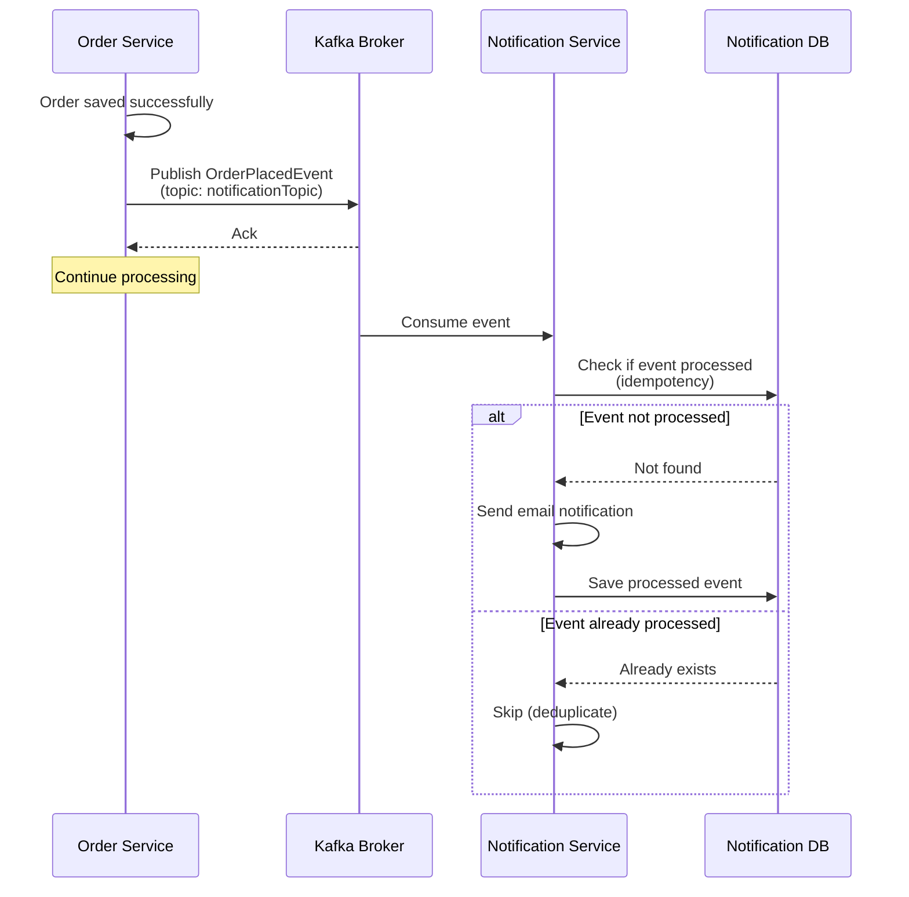
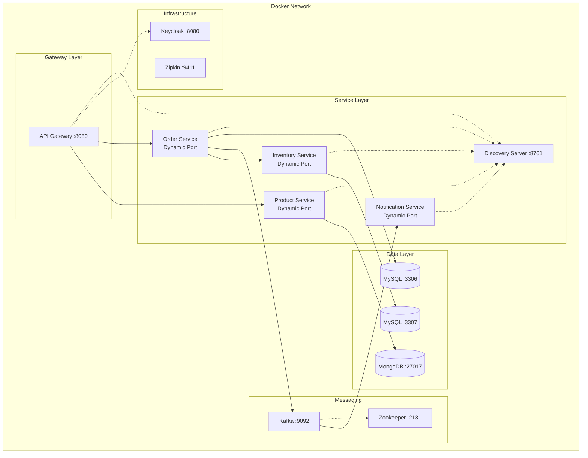

# StockXpress Architecture Documentation

## Table of Contents
1. [C4 Model Overview](#c4-model-overview)
2. [Context Diagram (Level 1)](#context-diagram-level-1)
3. [Container Diagram (Level 2)](#container-diagram-level-2)
4. [Component Diagrams (Level 3)](#component-diagrams-level-3)
   - [API Gateway Components](#api-gateway-components)
   - [Order Service Components](#order-service-components)
5. [Technology Stack](#technology-stack)
6. [Infrastructure Components](#infrastructure-components)
7. [Communication Patterns](#communication-patterns)

---

## C4 Model Overview

The C4 model provides a structured approach to visualizing software architecture at different levels of abstraction:
- **Level 1 (Context)**: System context showing external actors and system boundaries
- **Level 2 (Container)**: Runtime containers (applications, databases, message brokers)
- **Level 3 (Component)**: Internal components within selected containers
- **Level 4 (Code)**: Implementation details (documented in source code)

---

## Context Diagram (Level 1)

### System in Environment

The Context diagram shows how StockXpress fits into the broader business environment and who uses it.



### Key Actors

| Actor | Description | Key Interactions |
|-------|-------------|------------------|
| **Customer** | End users of the e-commerce platform | Browse products, place orders, check order status |
| **Administrator** | Platform operators and business users | Manage product catalog, view inventory, monitor orders |
| **External Systems** | Third-party integrations | Payment processing, shipping, email delivery |
| **Keycloak** | IAM provider | OAuth 2.0 authentication, JWT token issuance |
| **Zipkin** | Observability platform | Distributed tracing, latency monitoring |

---

## Container Diagram (Level 2)

### All Services, Databases, and Message Brokers



### Container Responsibilities

#### API Layer
| Container | Technology | Port | Responsibility |
|-----------|-----------|------|----------------|
| **API Gateway** | Spring Cloud Gateway | 8080 | Single entry point, routing, load balancing, JWT validation, CORS handling |

#### Service Discovery
| Container | Technology | Port | Responsibility |
|-----------|-----------|------|----------------|
| **Discovery Server** | Netflix Eureka | 8761 | Service registration, health checks, service discovery, load balancing metadata |

#### Business Services
| Container | Technology | Port | Responsibility |
|-----------|-----------|------|----------------|
| **Product Service** | Spring Boot 2.7.14 | Dynamic | Product CRUD operations, catalog management |
| **Order Service** | Spring Boot 2.7.14 | Dynamic | Order orchestration, inventory validation, saga coordination |
| **Inventory Service** | Spring Boot 2.7.14 | Dynamic | Stock availability checks, inventory queries |
| **Notification Service** | Spring Boot 2.7.14 | Dynamic | Event consumption, notification dispatch, idempotency |

#### Data Stores
| Container | Technology | Port | Data Stored |
|-----------|-----------|------|-------------|
| **MongoDB** | MongoDB 4.4.14 | 27017 | Product catalog (documents) |
| **Order Database** | MySQL 5.7 | 3306 | Orders, order line items |
| **Inventory Database** | MySQL 5.7 | 3307 | Inventory records, SKU quantities |
| **Notification Database** | MySQL 5.7 | 3306 | Processed events (idempotency) |

#### Message Broker
| Container | Technology | Port | Responsibility |
|-----------|-----------|------|----------------|
| **Apache Kafka** | Kafka 7.0.1 | 9092 | Event streaming, async messaging, topic: `notificationTopic` |
| **Zookeeper** | Zookeeper 7.0.1 | 2181 | Kafka cluster coordination, leader election |

#### Infrastructure
| Container | Technology | Port | Responsibility |
|-----------|-----------|------|----------------|
| **Keycloak** | Keycloak 18.0.0 | 8080 | OAuth 2.0 provider, JWT issuer, realm: `stockxpress` |
| **Zipkin** | Zipkin | 9411 | Distributed tracing, request correlation, latency analysis |

---

## Component Diagrams (Level 3)

### API Gateway Components



#### Key Components

| Component | Responsibility | Technology |
|-----------|----------------|------------|
| **ApiGatewayApplication** | Bootstrap application, route initialization | Spring Boot |
| **SecurityConfig** | Configure OAuth 2.0 resource server, JWT validation | Spring Security |
| **Route Configuration** | Define routing rules to downstream services | Spring Cloud Gateway |
| **Load Balancer** | Distribute requests across service instances | Spring Cloud LoadBalancer |
| **CORS Filter** | Handle cross-origin resource sharing | Spring Web |
| **Tracing Filter** | Correlation ID propagation, distributed tracing | Spring Cloud Sleuth |

---

### Order Service Components



#### Key Components

| Component | Responsibility | Pattern/Technology |
|-----------|----------------|--------------------|
| **OrderController** | REST API endpoint, request/response handling | MVC Controller |
| **OrderService** | Orchestrate order placement workflow, saga coordination | Service Layer, Transaction Management |
| **OrderValidator** | Validate order requests, inventory availability | Validator Pattern |
| **OrderMapper** | Map between DTOs and entities | Mapper Pattern |
| **InventoryClient** | Synchronous HTTP calls to Inventory Service | Adapter Pattern, WebClient |
| **OrderEventPublisher** | Publish domain events to Kafka | Event Publisher Pattern |
| **OrderRepository** | Data persistence operations | Repository Pattern, Spring Data JPA |
| **Circuit Breaker** | Fault tolerance, fallback mechanisms | Circuit Breaker Pattern, Resilience4j |
| **Retry Policy** | Automatic retry with exponential backoff | Retry Pattern |
| **Time Limiter** | Timeout management for external calls | Timeout Pattern |
| **Logging Aspect** | Performance monitoring, parameter logging | AOP, Cross-Cutting Concern |
| **Cache Manager** | Cache inventory checks, order queries | Cache-Aside Pattern, Caffeine |
| **Exception Handler** | Centralized error handling | Exception Handler Pattern |

---

## Technology Stack

### Core Framework
- **Spring Boot**: 2.7.14
- **Spring Cloud**: 2021.0.8
- **Java**: 8
- **Maven**: Build tool

### Service Communication
| Technology | Purpose | Version |
|-----------|---------|----------|
| Spring Cloud Gateway | API Gateway | 2021.0.8 |
| Netflix Eureka | Service Discovery | 2021.0.8 |
| WebClient | HTTP Client (non-blocking) | Spring WebFlux |
| Apache Kafka | Event Streaming | 7.0.1 |

### Data Persistence
| Technology | Purpose | Version |
|-----------|---------|----------|
| Spring Data JPA | Relational data access | 2.7.14 |
| Spring Data MongoDB | Document data access | 2.7.14 |
| Hibernate | ORM | 5.6.x |
| MySQL | Relational database | 5.7 |
| MongoDB | Document database | 4.4.14 |

### Resilience & Fault Tolerance
| Technology | Purpose | Configuration |
|-----------|---------|---------------|
| Resilience4j Circuit Breaker | Prevent cascading failures | 50% failure threshold, 5s wait |
| Resilience4j Retry | Automatic retries | 3 attempts, exponential backoff |
| Resilience4j Time Limiter | Timeout management | 3s timeout |
| Caffeine Cache | In-memory caching | 10min TTL, 500 max entries |

### Security
| Technology | Purpose | Version |
|-----------|---------|----------|
| Keycloak | IAM, OAuth 2.0 provider | 18.0.0 |
| Spring Security | Security framework | 5.7.x |
| OAuth 2.0 | Authorization protocol | - |
| OpenID Connect | Authentication protocol | - |
| JWT | Token format | - |

### Observability
| Technology | Purpose | Version |
|-----------|---------|----------|
| Spring Cloud Sleuth | Distributed tracing | 2021.0.8 |
| Zipkin | Trace aggregation & visualization | Latest |
| Micrometer | Metrics facade | 1.9.x |
| Spring Boot Actuator | Health checks, metrics | 2.7.14 |

### Testing
| Technology | Purpose |
|-----------|----------|
| JUnit 5 | Unit testing |
| Mockito | Mocking framework |
| TestContainers | Integration testing | 1.18.3 |
| Spring Boot Test | Integration test support |

### DevOps
| Technology | Purpose | Version |
|-----------|---------|----------|
| Docker | Containerization | - |
| Docker Compose | Multi-container orchestration | v3 |
| Jib | Container image builder | 3.2.1 |

---

## Infrastructure Components

### Containerization
All services are containerized using Docker with Jib Maven plugin:
- **Base Image**: `eclipse-temurin:8-jre`
- **Registry**: Docker Hub (`seshrao/*`)
- **Build Tool**: Jib (no Docker daemon required)

### Service Discovery Flow


### Health Check Configuration
- **Lease Renewal**: 5 seconds
- **Lease Expiration**: 10 seconds
- **Registry Fetch**: 5 seconds
- **IP Preference**: Enabled (use IP instead of hostname)

---

## Communication Patterns

### Synchronous Communication (HTTP/REST)



**Use Cases:**
- Order Service → Inventory Service: Stock availability checks
- Client → Product Service: Product catalog queries
- Client → Order Service: Order placement

**Technologies:**
- Spring WebClient (reactive, non-blocking)
- Circuit Breaker for fault tolerance
- Retry with exponential backoff

### Asynchronous Communication (Kafka)



**Use Cases:**
- Order Service → Notification Service: Order placed notifications
- Future: Inventory Service → Order Service: Stock level alerts

**Technologies:**
- Apache Kafka 7.0.1
- Topic: `notificationTopic`
- JSON serialization
- Idempotent consumer pattern

### Event Schema

**OrderPlacedEvent:**
```json
{
  "eventId": "uuid",
  "eventVersion": "1.0",
  "timestamp": "2024-01-15T10:30:00",
  "orderNumber": "ORD-123456",
  "orderId": 789,
  "orderLineItems": [
    {
      "skuCode": "SKU-001",
      "price": 29.99,
      "quantity": 2
    }
  ],
  "metadata": {
    "source": "order-service",
    "environment": "production"
  }
}
```

---

## Deployment Architecture



### Port Allocation
| Service | Port | Accessibility |
|---------|------|---------------|
| API Gateway | 8080 | Public |
| Discovery Server | 8761 | Internal (via Gateway) |
| Keycloak | 8181 | Public (realm endpoint) |
| Zipkin | 9411 | Internal |
| Kafka | 9092 | Internal |
| Zookeeper | 2181 | Internal |
| MongoDB | 27017 | Internal |
| MySQL (Order) | 3306 | Internal |
| MySQL (Inventory) | 3307 | Internal |
| Business Services | Dynamic | Internal (via Gateway) |

---

## Quality Attributes

### Scalability
- **Horizontal Scaling**: Each service can scale independently
- **Dynamic Port Assignment**: Prevents port conflicts
- **Load Balancing**: Client-side load balancing via Eureka
- **Stateless Services**: No session affinity required

### Reliability
- **Circuit Breaker**: Prevents cascading failures (50% threshold)
- **Retry Mechanism**: 3 attempts with exponential backoff
- **Timeout Management**: 3s timeout for external calls
- **Health Checks**: Continuous monitoring via Eureka
- **Event Deduplication**: Idempotent consumer pattern

### Observability
- **Distributed Tracing**: End-to-end request tracking with Zipkin
- **Correlation IDs**: MDC logging for request correlation
- **Metrics**: Actuator endpoints for Prometheus integration
- **Structured Logging**: JSON-formatted logs with context

### Security
- **OAuth 2.0**: Industry-standard authorization
- **JWT Tokens**: Stateless authentication
- **Centralized IAM**: Keycloak for user management
- **API Gateway**: Single security checkpoint

### Maintainability
- **Separation of Concerns**: Clear service boundaries
- **Common Library**: Shared utilities, exceptions, DTOs
- **Consistent Patterns**: Repository, Service, Controller layers
- **Comprehensive Testing**: Unit, integration, and contract tests

---

## Future Architecture Enhancements

1. **API Versioning**: URL-based versioning (`/api/v1/`, `/api/v2/`)
2. **GraphQL Gateway**: Alternative query language for flexible data fetching
3. **CQRS**: Separate read/write models for complex domains
4. **Saga Orchestrator**: Centralized saga coordination service
5. **Event Sourcing**: Store events instead of state for audit trail
6. **Service Mesh**: Istio for advanced traffic management
7. **Kubernetes**: Container orchestration for production
8. **API Rate Limiting**: Prevent abuse via Redis-backed throttling
9. **Feature Toggles**: Gradual feature rollout capability
10. **Multi-Region Deployment**: Geographic distribution for low latency

---

## References

- [C4 Model Documentation](https://c4model.com/)
- [Spring Cloud Documentation](https://spring.io/projects/spring-cloud)
- [Microservices Patterns](https://microservices.io/patterns/)
- [Domain-Driven Design](https://martinfowler.com/bliki/DomainDrivenDesign.html)
- [Resilience4j Documentation](https://resilience4j.readme.io/)

---

**Document Version**: 1.0  
**Last Updated**: 2024  
**Maintained By**: StockXpress Architecture Team
