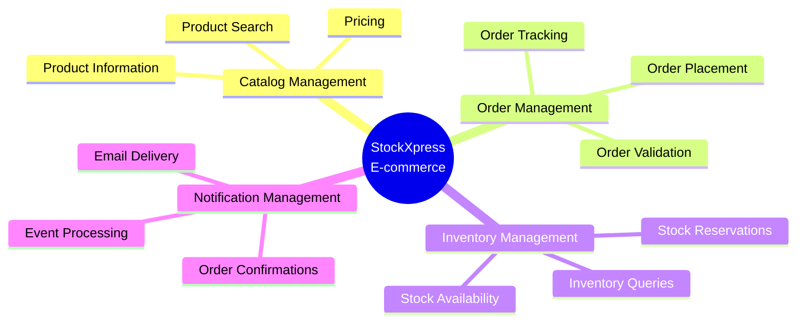
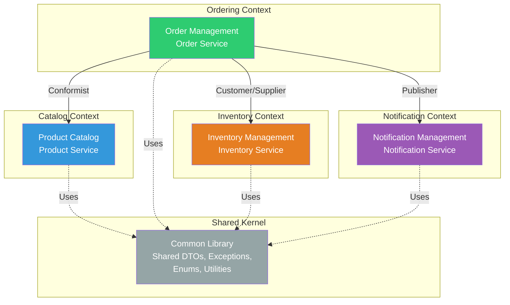
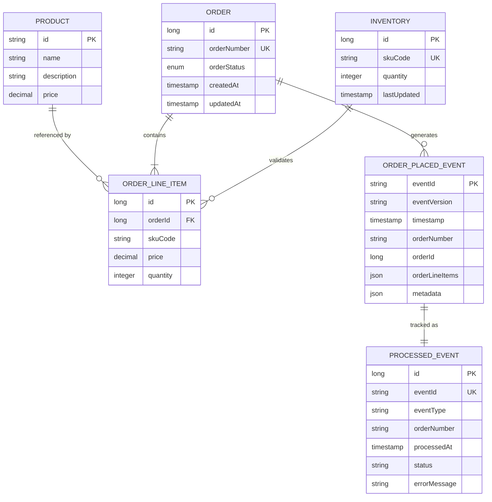
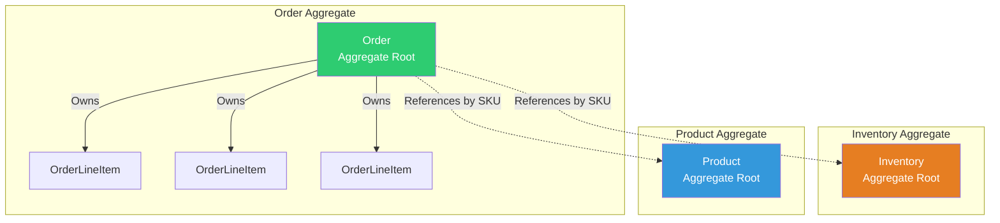
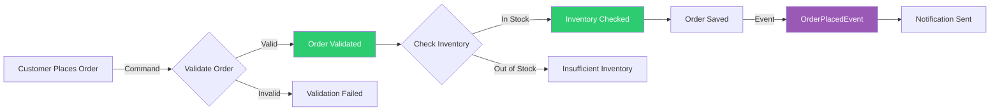
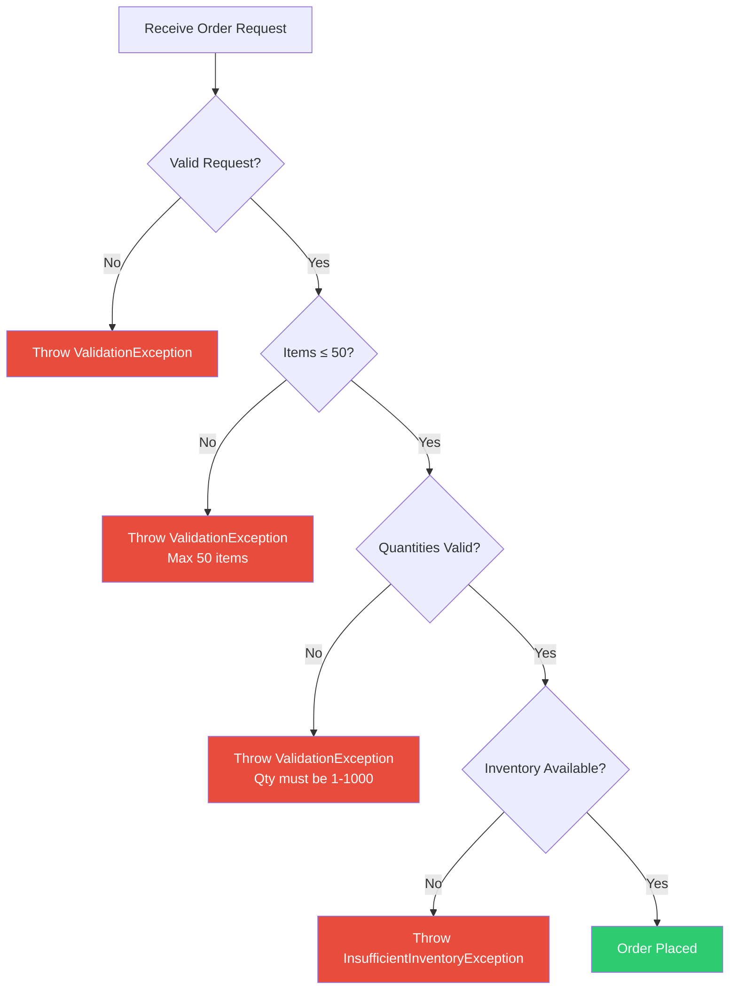

# StockXpress Domain Model Documentation

## Table of Contents
1. [Domain Overview](#domain-overview)
2. [Bounded Contexts](#bounded-contexts)
3. [Core Business Entities](#core-business-entities)
4. [Entity Relationships](#entity-relationships)
5. [Aggregate Roots and Boundaries](#aggregate-roots-and-boundaries)
6. [Value Objects](#value-objects)
7. [Domain Events](#domain-events)
8. [Business Rules](#business-rules)
9. [Domain Services](#domain-services)

---

## Domain Overview

StockXpress is an e-commerce platform built using **Domain-Driven Design (DDD)** principles. The domain is organized into distinct **bounded contexts** that represent different areas of the business. Each bounded context has its own ubiquitous language and is implemented as one or more microservices.

### Core Business Capabilities



---

## Bounded Contexts

### Context Map



### Bounded Context Details

| Bounded Context | Service | Database | Ubiquitous Language | Responsibilities |
|----------------|---------|----------|---------------------|------------------|
| **Catalog** | Product Service | MongoDB | Product, Catalog, SKU, Price, Description | Manage product catalog, product search, pricing information |
| **Ordering** | Order Service | MySQL | Order, OrderLineItem, OrderNumber, Quantity | Order placement, order validation, inventory orchestration |
| **Inventory** | Inventory Service | MySQL | Inventory, SKU Code, Stock, Quantity, Availability | Stock tracking, availability checks, inventory queries |
| **Notifications** | Notification Service | MySQL | Notification, Event, ProcessedEvent, Idempotency | Event consumption, notification dispatch, event deduplication |

### Context Relationships

| Relationship Pattern | Contexts | Description |
|---------------------|----------|-------------|
| **Customer/Supplier** | Ordering → Inventory | Order Service consumes Inventory Service API; Inventory team provides stable API |
| **Conformist** | Ordering → Catalog | Order Service accepts Product Service's model (SKU codes) without translation |
| **Publisher/Subscriber** | Ordering → Notifications | Order Service publishes events; Notification Service subscribes asynchronously |
| **Shared Kernel** | All Contexts → Common Library | Shared exceptions, enums, DTOs, utilities maintained collaboratively |

---

## Core Business Entities

### Entity-Relationship Diagram



### Entity Descriptions

#### 1. Product (Catalog Context)

**Aggregate Root**: Yes  
**Persistence**: MongoDB (document store)  
**Package**: `com.seshrao.stockxpress.productservice.model`

| Field | Type | Constraints | Description |
|-------|------|-------------|-------------|
| `id` | String | Primary Key, Auto-generated | Unique product identifier (MongoDB ObjectId) |
| `name` | String | Not null | Product name |
| `description` | String | Optional | Detailed product description |
| `price` | BigDecimal | Not null, > 0 | Product price in base currency |

**Invariants:**
- Price must be greater than zero
- Name must not be blank

**Example:**
```json
{
  "id": "507f1f77bcf86cd799439011",
  "name": "Wireless Mouse",
  "description": "Ergonomic wireless mouse with 2.4GHz connectivity",
  "price": 29.99
}
```

---

#### 2. Order (Ordering Context)

**Aggregate Root**: Yes  
**Persistence**: MySQL (relational)  
**Package**: `com.seshrao.stockxpress.orderservice.model`

| Field | Type | Constraints | Description |
|-------|------|-------------|-------------|
| `id` | Long | Primary Key, Auto-increment | Technical identifier |
| `orderNumber` | String | Unique, Not null | Business identifier (e.g., "ORD-20240115-001") |
| `orderLineItemList` | List\<OrderLineItem\> | Cascade ALL, Not empty | Items in the order |
| `orderStatus` | OrderStatus | Enum | Order lifecycle state |
| `createdAt` | LocalDateTime | Auto-generated | Order creation timestamp |
| `updatedAt` | LocalDateTime | Auto-updated | Last modification timestamp |

**Invariants:**
- Order must have at least one line item
- Order number must be unique across the system
- Maximum 50 line items per order

**Lifecycle States** (OrderStatus enum):
```
PENDING → CONFIRMED → PROCESSING → SHIPPED → DELIVERED
          ↓
       CANCELLED / REJECTED / FAILED
```

---

#### 3. OrderLineItem (Ordering Context)

**Aggregate Root**: No (part of Order aggregate)  
**Persistence**: MySQL (child table)  
**Package**: `com.seshrao.stockxpress.orderservice.model`

| Field | Type | Constraints | Description |
|-------|------|-------------|-------------|
| `id` | Long | Primary Key, Auto-increment | Technical identifier |
| `skuCode` | String | Not null | Product SKU (Stock Keeping Unit) |
| `price` | BigDecimal | Not null, > 0 | Unit price at time of order |
| `quantity` | Integer | Not null, 1-1000 | Quantity ordered |

**Invariants:**
- Quantity must be between 1 and 1000
- Price must match product price at order time (snapshot)
- SKU code must reference a valid product

**Example:**
```json
{
  "id": 1,
  "skuCode": "MOUSE-WL-001",
  "price": 29.99,
  "quantity": 2
}
```

---

#### 4. Inventory (Inventory Context)

**Aggregate Root**: Yes  
**Persistence**: MySQL (relational)  
**Package**: `com.seshrao.stockxpress.inventoryservice.model`

| Field | Type | Constraints | Description |
|-------|------|-------------|-------------|
| `id` | Long | Primary Key, Auto-increment | Technical identifier |
| `skuCode` | String | Unique, Indexed, Not blank | Product SKU identifier |
| `quantity` | Integer | Not null, ≥ 0 | Available stock quantity |
| `lastUpdated` | LocalDateTime | Auto-updated | Last inventory update |

**Invariants:**
- SKU code must be unique
- Quantity cannot be negative
- Indexed on `skuCode` and `quantity` for performance

**Database Indexes:**
```sql
CREATE UNIQUE INDEX idx_sku_code ON t_inventory(sku_code);
CREATE INDEX idx_quantity ON t_inventory(quantity);
```

---

#### 5. ProcessedEvent (Notification Context)

**Aggregate Root**: Yes  
**Persistence**: MySQL (relational)  
**Package**: `com.seshrao.stockxpress.notificationservice.model`

| Field | Type | Constraints | Description |
|-------|------|-------------|-------------|
| `id` | Long | Primary Key, Auto-increment | Technical identifier |
| `eventId` | String | Unique, Indexed, Not null | Event correlation ID |
| `eventType` | String | Not null | Event type (e.g., "ORDER_PLACED") |
| `orderNumber` | String | Optional | Related order number |
| `processedAt` | LocalDateTime | Not null | Processing timestamp |
| `notificationTypes` | String | CSV format | Notifications sent (e.g., "EMAIL,SMS") |
| `status` | String | Enum: SUCCESS, FAILED, PARTIAL | Processing status |
| `errorMessage` | String | Optional, max 1000 chars | Error details if failed |

**Purpose**: Implements **idempotent consumer pattern** to prevent duplicate event processing.

**Database Indexes:**
```sql
CREATE UNIQUE INDEX idx_event_id ON processed_events(event_id);
CREATE INDEX idx_processed_at ON processed_events(processed_at);
```

---

## Aggregate Roots and Boundaries

### Aggregate Design Principles



### Aggregate Definitions

#### Order Aggregate

**Aggregate Root**: `Order`  
**Entities**: `Order`, `OrderLineItem`  
**Bounded Context**: Ordering

**Consistency Boundary:**
- All order line items are created/updated/deleted with the order
- Transactional consistency within the aggregate
- Cascade operations: `CascadeType.ALL`

**Access Rules:**
- External services must reference orders by `orderNumber` (not technical ID)
- Order line items cannot exist without a parent order
- Order line items cannot be accessed directly from outside the aggregate

**Invariants Enforced:**
1. Order must have at least one line item
2. Maximum 50 line items per order
3. Sum of line item quantities must be ≥ 1
4. All SKU codes must be valid

---

#### Product Aggregate

**Aggregate Root**: `Product`  
**Entities**: `Product` (single entity aggregate)  
**Bounded Context**: Catalog

**Consistency Boundary:**
- Product is self-contained
- No child entities (document model)

**Invariants Enforced:**
1. Price must be > 0
2. Name must not be blank

---

#### Inventory Aggregate

**Aggregate Root**: `Inventory`  
**Entities**: `Inventory` (single entity aggregate)  
**Bounded Context**: Inventory

**Consistency Boundary:**
- One inventory record per SKU
- Atomic quantity updates

**Invariants Enforced:**
1. Quantity must be ≥ 0
2. SKU code must be unique

**Future Enhancement:** Inventory Reservation sub-entity for pessimistic locking

---

#### ProcessedEvent Aggregate

**Aggregate Root**: `ProcessedEvent`  
**Entities**: `ProcessedEvent` (single entity aggregate)  
**Bounded Context**: Notifications

**Consistency Boundary:**
- Idempotency tracking per event ID
- Atomic event processing state

**Invariants Enforced:**
1. Event ID must be unique
2. Processing timestamp must be set

---

## Value Objects

Value objects are immutable, have no identity, and are defined by their attributes.

### Current Value Objects

#### 1. OrderLineItemDto

**Package**: `com.seshrao.stockxpress.orderservice.dto`  
**Purpose**: Transfer object for order line items in API requests

```java
public class OrderLineItemDto {
    private String skuCode;
    private BigDecimal price;
    private Integer quantity;
}
```

**Characteristics:**
- Immutable (via builder pattern)
- No identity
- Validated on construction

---

#### 2. InventoryResponse

**Package**: `com.seshrao.stockxpress.orderservice.dto`  
**Purpose**: Represents inventory availability for a SKU

```java
public class InventoryResponse {
    private String skuCode;
    private boolean isInStock;
    private Integer availableQuantity;
}
```

**Characteristics:**
- Immutable snapshot of inventory state
- No identity (identified by SKU code)

---

#### 3. ErrorResponse

**Package**: `com.seshrao.stockxpress.common.dto`  
**Purpose**: Standardized error representation

```java
public class ErrorResponse {
    private String errorCode;
    private String message;
    private LocalDateTime timestamp;
    private String path;
    private List<ValidationError> validationErrors;
}
```

---

### Enumerations (Value Objects)

#### OrderStatus

**Package**: `com.seshrao.stockxpress.common.enums`

```java
public enum OrderStatus {
    PENDING,
    CONFIRMED,
    PROCESSING,
    SHIPPED,
    DELIVERED,
    CANCELLED,
    REJECTED,
    FAILED
}
```

**Domain Methods:**
- `isCancellable()`: Returns true if order can be cancelled
- `isFinal()`: Returns true if order is in terminal state

---

#### EventType

**Package**: `com.seshrao.stockxpress.common.enums`

```java
public enum EventType {
    ORDER_PLACED,
    ORDER_CONFIRMED,
    ORDER_CANCELLED,
    INVENTORY_RESERVED,
    INVENTORY_RELEASED,
    NOTIFICATION_SENT
}
```

**Domain Methods:**
- `isOrderEvent()`: Check if event is order-related
- `isInventoryEvent()`: Check if event is inventory-related
- `getByCategory(String category)`: Filter events by category

---

## Domain Events

### Event Storming Results



### Domain Events Catalog

#### 1. OrderPlacedEvent

**Published By**: Order Service  
**Consumed By**: Notification Service  
**Transport**: Kafka (topic: `notificationTopic`)  
**Package**: `com.seshrao.stockxpress.orderservice.event`

**Schema:**
```json
{
  "eventId": "uuid-v4",
  "eventVersion": "1.0",
  "timestamp": "2024-01-15T10:30:00Z",
  "orderNumber": "ORD-20240115-001",
  "orderId": 123,
  "orderLineItems": [
    {
      "skuCode": "MOUSE-WL-001",
      "price": 29.99,
      "quantity": 2
    }
  ],
  "metadata": {
    "source": "order-service",
    "environment": "production",
    "userId": "user@example.com"
  }
}
```

**Event Fields:**

| Field | Type | Purpose |
|-------|------|----------|
| `eventId` | String (UUID) | Unique event identifier for idempotency |
| `eventVersion` | String | Schema version for backward compatibility |
| `timestamp` | LocalDateTime | When the event occurred |
| `orderNumber` | String | Business identifier for the order |
| `orderId` | Long | Technical identifier |
| `orderLineItems` | List | Snapshot of order items at event time |
| `metadata` | Map | Additional context (source, environment, user) |

**Event Processing:**
1. Order Service publishes event after successful order persistence
2. Kafka broker persists event
3. Notification Service consumes event
4. Check if event already processed (idempotency)
5. Send notification if not processed
6. Record event as processed

**Idempotency:**
- Event ID is unique (UUID v4)
- Notification Service checks `ProcessedEvent` table before processing
- Duplicate events are safely ignored

---

### Future Domain Events

| Event | Publisher | Consumer(s) | Purpose |
|-------|-----------|-------------|----------|
| **OrderConfirmedEvent** | Order Service | Inventory Service, Notification Service | Trigger inventory reservation |
| **OrderCancelledEvent** | Order Service | Inventory Service, Notification Service | Release reserved inventory |
| **InventoryReservedEvent** | Inventory Service | Order Service | Confirm stock reservation |
| **InventoryReleasedEvent** | Inventory Service | Order Service | Notify reservation release |
| **PaymentCompletedEvent** | Payment Service | Order Service | Confirm payment |
| **OrderShippedEvent** | Fulfillment Service | Order Service, Notification Service | Update order status |

---

## Business Rules

### Order Placement Rules



### Validation Rules

#### Order Request Validation

| Rule | Validation | Exception |
|------|------------|------------|
| Order must have line items | `!orderLineItemList.isEmpty()` | ValidationException |
| Maximum 50 line items | `orderLineItemList.size() <= 50` | ValidationException |
| SKU code not blank | `!skuCode.isBlank()` | ValidationException |
| Quantity in range | `quantity >= 1 && quantity <= 1000` | ValidationException |
| Price positive | `price.compareTo(BigDecimal.ZERO) > 0` | ValidationException |
| No duplicate SKUs | Unique SKU codes in line items | ValidationException |

#### Inventory Validation

| Rule | Validation | Exception |
|------|------------|------------|
| All SKUs must exist | Check all SKUs in inventory | InsufficientInventoryException |
| All SKUs in stock | `quantity > 0` for all items | InsufficientInventoryException |
| Sufficient quantity | `availableQty >= requestedQty` | InsufficientInventoryException |

---

## Domain Services

### Order Orchestration Service

**Purpose**: Coordinate order placement across multiple aggregates and bounded contexts

**Responsibilities:**
1. Validate order request
2. Check inventory availability (external call)
3. Create order aggregate
4. Persist order
5. Publish OrderPlacedEvent
6. Handle compensating transactions (saga pattern)

**Transaction Boundaries:**
- Local transaction: Order persistence
- Distributed transaction: Inventory check + Order creation + Event publishing
- Compensation: Delete order if event publishing fails

---

### Inventory Availability Service

**Purpose**: Determine if products are available for order

**Responsibilities:**
1. Query inventory by SKU codes
2. Return availability status
3. Cache results (10-minute TTL)

**Caching Strategy:**
- Cache key: SKU codes (sorted, comma-separated)
- TTL: 10 minutes
- Eviction: LRU (max 500 entries)

---

### Notification Dispatch Service

**Purpose**: Process order events and send notifications

**Responsibilities:**
1. Consume OrderPlacedEvent from Kafka
2. Check idempotency (event already processed?)
3. Execute notification strategy (email, SMS, push)
4. Record processed event
5. Handle failures gracefully

**Idempotency Pattern:**
```java
if (processedEventRepository.existsByEventId(eventId)) {
    log.info("Event already processed: {}", eventId);
    return; // Skip duplicate
}

// Process notification
sendNotification(event);

// Record as processed
processedEventRepository.save(new ProcessedEvent(eventId, ...));
```

---

## Domain Model Evolution

### Versioning Strategy

| Aspect | Strategy |
|--------|----------|
| **API Versioning** | URL-based (`/api/v1/orders`, `/api/v2/orders`) |
| **Event Versioning** | Schema version field in events (`eventVersion: "1.0"`) |
| **Database Schema** | Flyway migrations for versioned schema changes |
| **Backward Compatibility** | Maintain old versions for 2 release cycles |

### Future Domain Enhancements

1. **Payment Aggregate**: Add payment processing and status tracking
2. **Customer Aggregate**: Add customer profiles, addresses, preferences
3. **Promotion Aggregate**: Add discount codes, campaigns, rules
4. **Shipping Aggregate**: Add fulfillment, tracking, delivery status
5. **Inventory Reservation**: Add pessimistic locking for stock holds
6. **Order History**: Add event sourcing for complete order audit trail

---

## Anti-Corruption Layers

### Order Service → Inventory Service

**Purpose**: Translate Inventory Service responses into Order domain language

**Implementation**: `InventoryClient` interface with adapter pattern

```java
// Order domain model
List<String> skuCodes = extractSkuCodes(order);

// Anti-corruption layer
List<InventoryResponse> responses = inventoryClient.checkInventory(skuCodes);

// Validate in order domain terms
orderValidator.validateInventoryAvailability(responses);
```

---

## References

- [Domain-Driven Design by Eric Evans](https://www.domainlanguage.com/ddd/)
- [Implementing Domain-Driven Design by Vaughn Vernon](https://vaughnvernon.com/)
- [Patterns, Principles, and Practices of Domain-Driven Design](https://www.wiley.com/)
- [Event Storming](https://www.eventstorming.com/)
- [Aggregate Design Canvas](https://github.com/ddd-crew/aggregate-design-canvas)

---

**Document Version**: 1.0  
**Last Updated**: 2024  
**Maintained By**: StockXpress Domain Modeling Team
