# StockXpress - Microservices Project

StockXpress is a microservices-based e-commerce platform designed to manage products, orders, and notifications efficiently. It utilizes Spring Boot and various technologies to provide a scalable and reliable system.

## Architechture Diagram

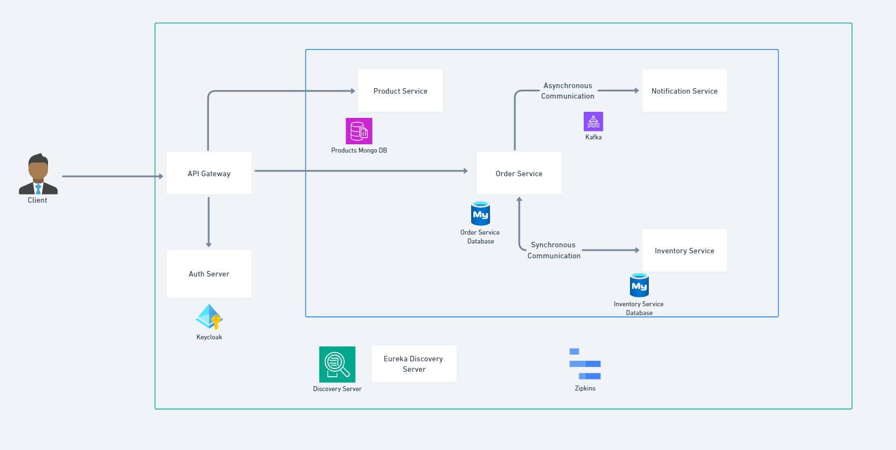

## Services

### Product Service

- **Description**: Acts as the Product Catalog. Allows for creating and viewing products.

### Order Service

- **Description**: Enables to place orders for products.

### Inventory Service

- **Description**: Used by the Order Service to check product availability before placing an order.

### Notification Service

- **Description**: Sends notifications after successful order placement.

### Discovery Service

- **Description**: Utilizes Netflix Eureka for Dynamic Service Registration, Service Lookup, and Load Balancing. Manages service discovery within the microservices architecture.

### API Gateway Service

- **Description**: Implements API Gateway using Spring Cloud Gateway for routing and load balancing of client requests.

## Features

### Keycloak identity and access management ( IAM )

- **Description**: Keycloak identity and access management ( IAM ) auth server is used to provide support for OAuth 2.0 and OpenID Connect, making it easy to secure APIs and provide identity information to client securely with JWT tokens. 

### Circuit Breaker

- **Description**: Utilizes circuit breakers to provide fault tolerance and prevent cascading failures. Implements fallback mechanisms to ensure system resilience.

### Zipkin

- **Description**: Utilizes Zipkin for distributed tracing, latency monitoring, and error tracing. Provides valuable insights into request processing and system performance.

### Kafka Event-Driven Architecture

- **Description**: Implements event-driven architecture using Kafka. The Order Service produces events stored in Kafka topics, and the Notification Service consumes these events for order notifications.

### Interactions

- **Synchronous Communication**: Order Service communicates synchronously with Inventory Service for product availability checks.
- **Asynchronous Communication**: Order Service communicates asynchronously with the Notification Service for order notifications.

### Dockerized Services

- **Description**: All services are containerized using Docker, facilitating easy deployment and scalability.

## Project Overview

1. KeyCloak Home

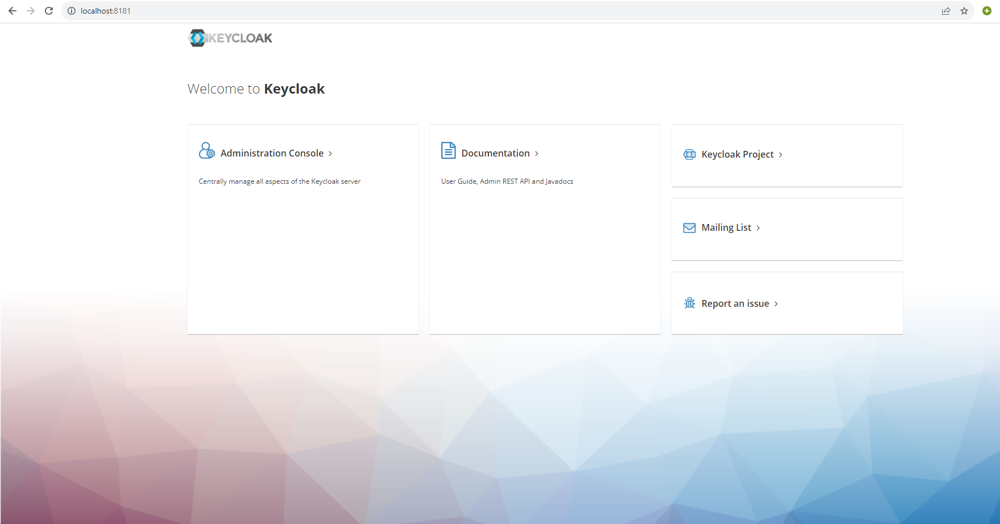

2. KeyCloak Create Realm

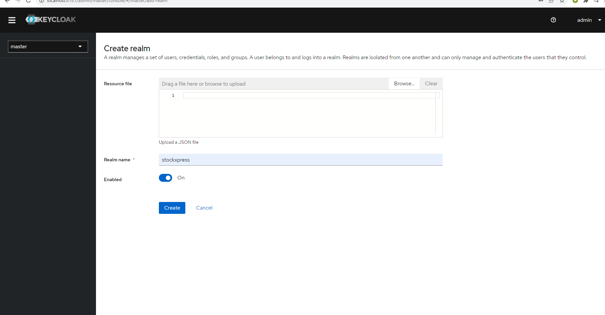

3. KeyCloak Create Client

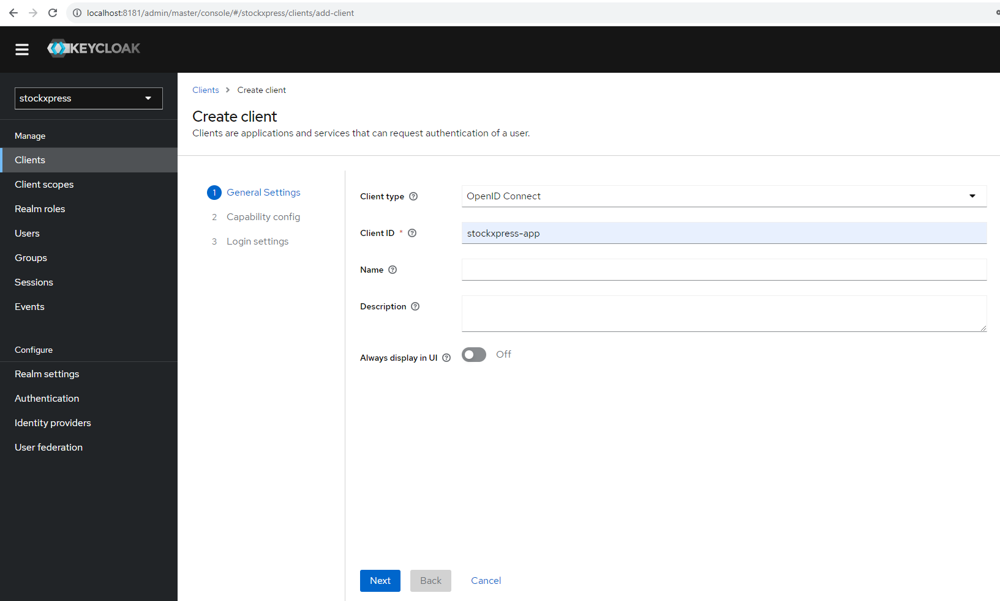

4. KeyCloak Create Client

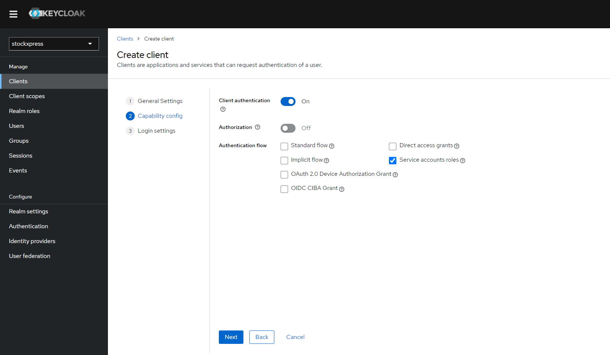

5. KeyCloak Client Secret

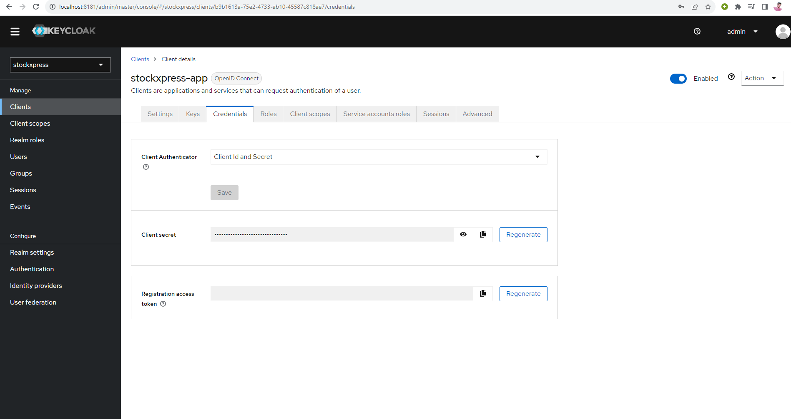

6. KeyCloak Access Token

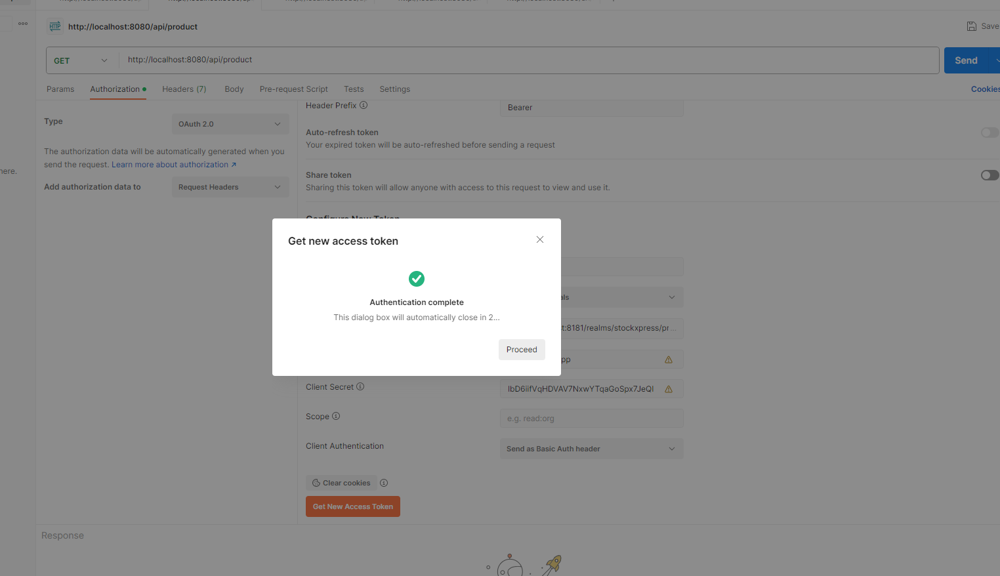

7. Unauthorized Request

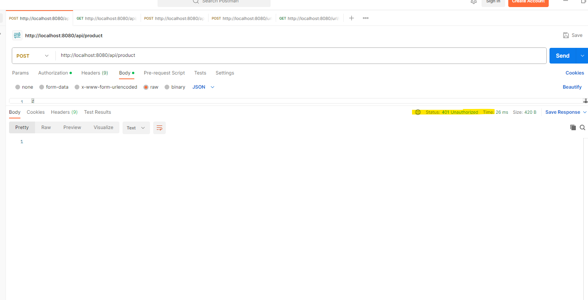

8. Product Catalogue

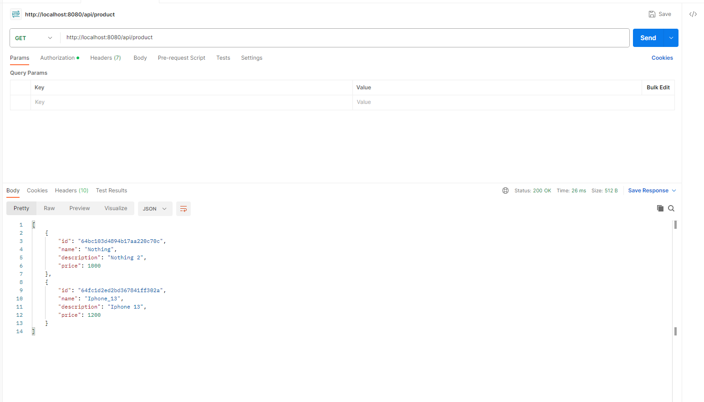

9. Out Of Order Stock
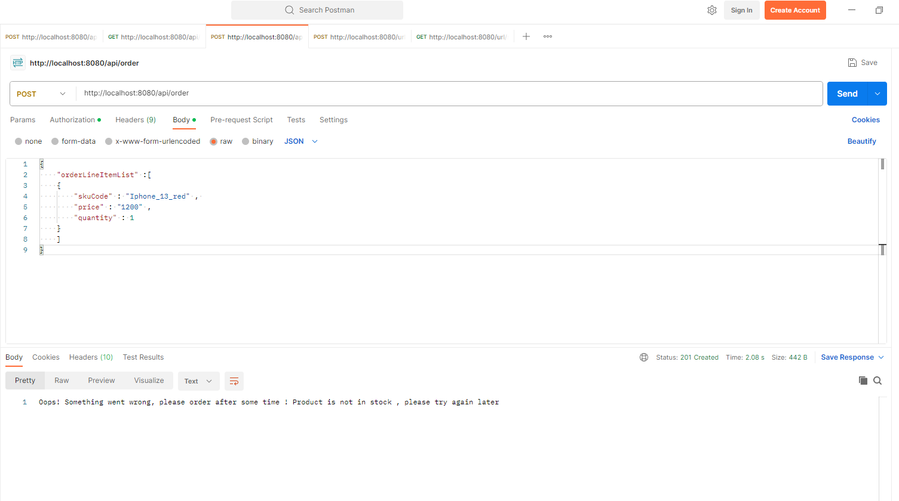

10. Successful Order
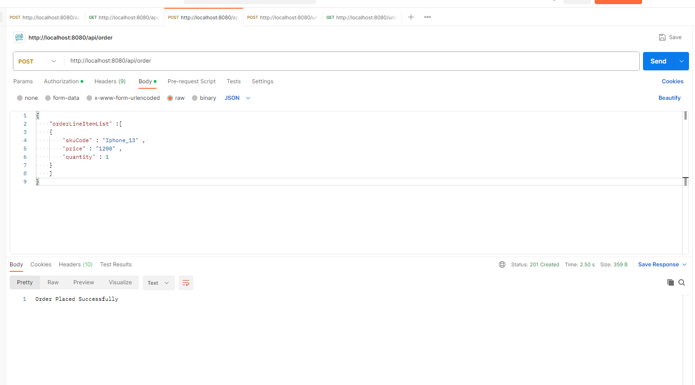

11. Eureka Server
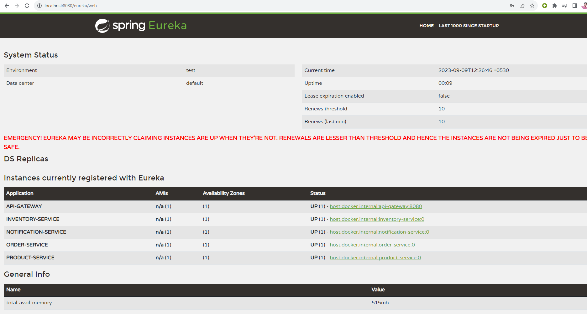

12. Zipkins Trace
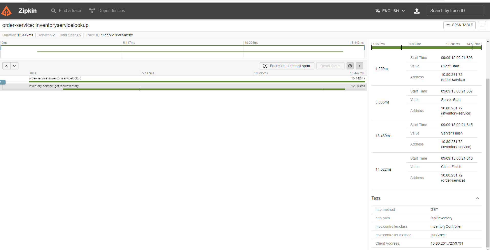

## Getting Started

To run the StockXpress microservices project locally, follow these steps:

1. Clone the repository: `git clone https://github.com/PSesharao/stockxpress.git`
2. Navigate to the project root: `cd stockxpress`
3. Build and run the individual services using Maven or Gradle.
4. Ensure Docker is installed and running on your system.
5. Build Docker images for each service.
6. Use Docker Compose to orchestrate the services and run the entire system.

## Acknowledgments

- This project concept draws inspiration from the Programming Techie.

