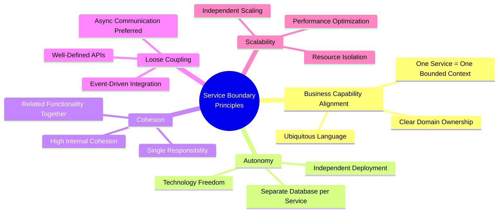
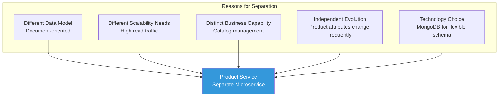
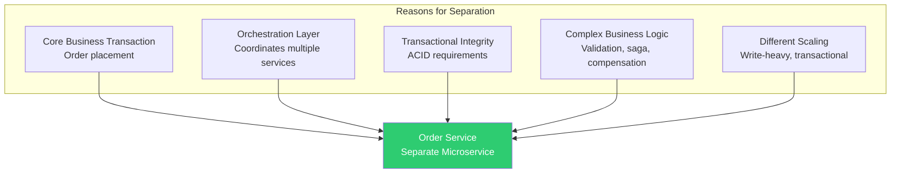
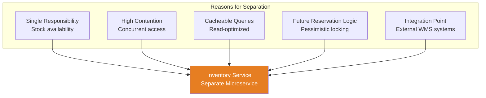
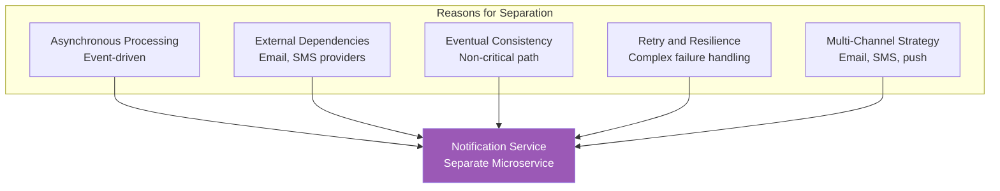
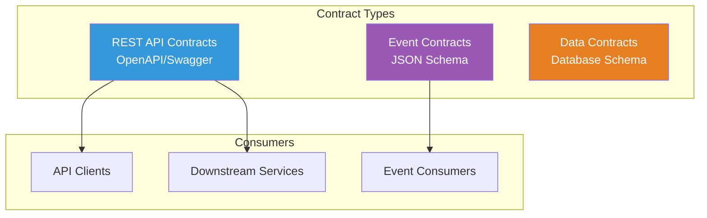
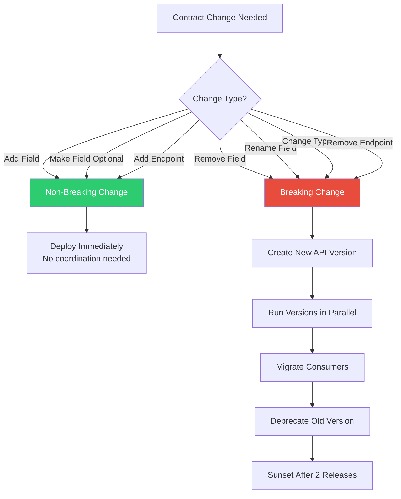
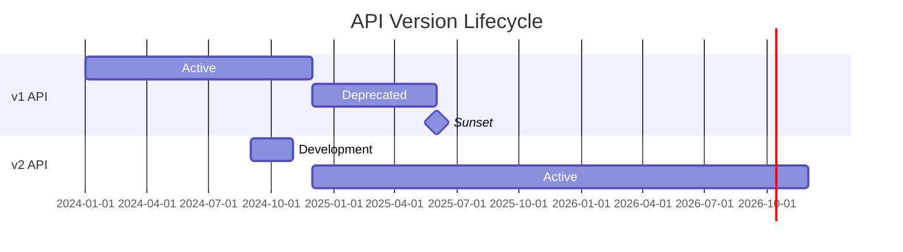
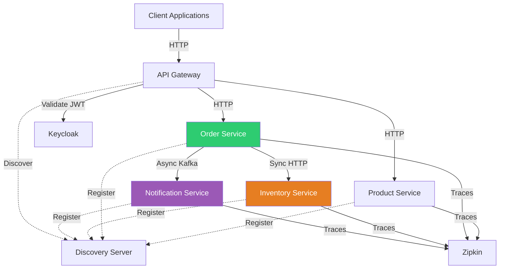
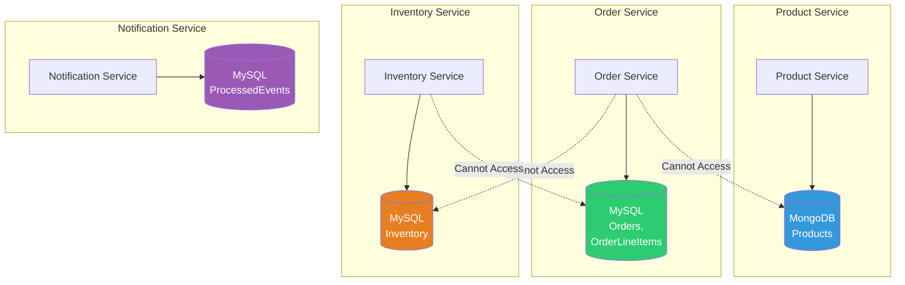

# StockXpress Service Boundaries Documentation

## Table of Contents
1. [Service Boundary Principles](#service-boundary-principles)
2. [Why Each Service is Separate](#why-each-service-is-separate)
3. [Service Responsibilities](#service-responsibilities)
4. [Service Contracts](#service-contracts)
5. [Contract Evolution Strategy](#contract-evolution-strategy)
6. [API Versioning Strategy](#api-versioning-strategy)
7. [Breaking vs Non-Breaking Changes](#breaking-vs-non-breaking-changes)
8. [Service Dependencies](#service-dependencies)
9. [Data Ownership](#data-ownership)

---

## Service Boundary Principles

### Design Principles

StockXpress service boundaries follow **Domain-Driven Design (DDD)** and **microservices best practices**:



### Service Decomposition Strategy

| Strategy | Description | Applied To |
|----------|-------------|------------|
| **Decompose by Business Capability** | Align services with business capabilities | Product Service (Catalog), Order Service (Ordering) |
| **Decompose by Subdomain** | Align with DDD bounded contexts | Inventory Service (Inventory Management) |
| **Decompose by Transaction** | Separate based on transaction boundaries | Order Service (transactional), Notification Service (eventual consistency) |
| **Strangler Fig Pattern** | Gradually extract services from monolith | Not applicable (greenfield project) |

---

## Why Each Service is Separate

### 1. Product Service

#### Bounded Context: Product Catalog Management

**Why Separate?**



**Detailed Rationale:**

| Aspect | Justification |
|--------|---------------|
| **Business Capability** | Product catalog management is a distinct business function handled by a separate team (merchandising) |
| **Data Model** | Products are best represented as documents (flexible schema for varying attributes) while orders are relational (structured, transactional) |
| **Scalability** | Product browsing has different traffic patterns (high read, low write) than order placement (balanced read/write, transactional) |
| **Rate of Change** | Product catalog structure changes frequently with new product types; keeping it separate prevents destabilizing order processing |
| **Team Ownership** | Merchandising team owns product catalog; order fulfillment team owns ordering |
| **Technology Choice** | MongoDB allows flexible product attributes without schema migrations |

**Independence Benefits:**
- Product catalog can scale independently during flash sales
- Schema changes (adding new product attributes) don't affect order processing
- Can optimize search and indexing specifically for product queries
- Deploy catalog updates without redeploying order service

---

### 2. Order Service

#### Bounded Context: Order Management

**Why Separate?**



**Detailed Rationale:**

| Aspect | Justification |
|--------|---------------|
| **Business Capability** | Order placement is the most critical business transaction in e-commerce |
| **Orchestration** | Acts as saga coordinator, orchestrating inventory checks, payment processing (future), and notifications |
| **Transactional Integrity** | Requires strong consistency (ACID) for order data, best achieved with dedicated database and transaction boundaries |
| **Business Complexity** | Complex validation rules, compensating transactions, and state management warrant dedicated service |
| **Event Publishing** | Central event publisher for order lifecycle events |
| **Performance Isolation** | Order processing latency must not be affected by product catalog or inventory issues |

**Independence Benefits:**
- Can implement sophisticated retry and circuit breaker logic without affecting other services
- Order database can be optimized for transactional writes
- Saga pattern implementation isolated from other services
- Can scale order processing independently during peak shopping periods

---

### 3. Inventory Service

#### Bounded Context: Inventory Management

**Why Separate?**



**Detailed Rationale:**

| Aspect | Justification |
|--------|---------------|
| **Business Capability** | Inventory management is distinct from order processing; handled by warehouse/operations team |
| **Concurrency** | High contention resource (multiple orders checking same SKUs simultaneously); needs specialized concurrency control |
| **Read Optimization** | Inventory checks are read-heavy and highly cacheable; separation allows aggressive caching |
| **Future Extensions** | Will integrate with Warehouse Management Systems (WMS), reservation logic, and real-time stock updates |
| **Performance** | Inventory queries must be fast (<100ms); dedicated service allows performance tuning |
| **Data Consistency** | Inventory is eventually consistent with order placement (acceptable business tradeoff) |

**Independence Benefits:**
- Can implement caching strategies (10-minute TTL) without affecting order accuracy
- Database can be optimized for read queries (indexed on `skuCode`)
- Future: Can implement inventory reservation (pessimistic locking) without changing order service
- Can integrate with external WMS systems without coupling to order service
- Can scale read replicas independently for inventory queries

---

### 4. Notification Service

#### Bounded Context: Notification Management

**Why Separate?**



**Detailed Rationale:**

| Aspect | Justification |
|--------|---------------|
| **Business Capability** | Notification management is a cross-cutting concern, not specific to orders |
| **Asynchronous Nature** | Notifications are asynchronous and non-blocking; don't delay order placement |
| **External Dependencies** | Integrates with third-party email/SMS providers (SendGrid, Twilio); failures shouldn't affect order service |
| **Eventual Consistency** | Notifications are eventually consistent; acceptable for user to receive email a few seconds after order |
| **Multi-Channel** | Will expand to SMS, push notifications, webhooks; separate service prevents bloating order service |
| **Idempotency** | Complex idempotency logic (ProcessedEvent tracking) isolated from order service |

**Independence Benefits:**
- Email provider outages don't affect order placement
- Can retry failed notifications without affecting order service
- Can add new notification channels (SMS, push) without modifying order service
- Can implement rate limiting for notification sending
- Deploy notification template changes independently

---

### 5. Discovery Server (Eureka)

#### Infrastructure Service

**Why Separate?**

| Aspect | Justification |
|--------|---------------|
| **Infrastructure Concern** | Service discovery is cross-cutting infrastructure, not business logic |
| **High Availability** | Must be available before any business service starts |
| **Centralized Registry** | Single source of truth for service locations |
| **Clustering** | Can run multiple Eureka servers for redundancy (future) |

**Independence Benefits:**
- Can upgrade Eureka version without touching business services
- Can implement Eureka clustering for high availability
- Business services remain decoupled from each other's physical locations

---

### 6. API Gateway

#### Edge Service

**Why Separate?**

| Aspect | Justification |
|--------|---------------|
| **Single Entry Point** | Provides unified API surface for clients |
| **Cross-Cutting Concerns** | Authentication, authorization, rate limiting, CORS |
| **Routing Logic** | Decouples client from service topology |
| **Security Boundary** | Single point to enforce security policies |

**Independence Benefits:**
- Can change internal service structure without breaking client contracts
- Can implement API versioning at gateway level
- Can add new services without client changes
- Can implement rate limiting and throttling centrally

---

## Service Responsibilities

### Responsibility Assignment Matrix

| Service | Primary Responsibilities | Secondary Responsibilities | Anti-Responsibilities (NOT owned) |
|---------|-------------------------|----------------------------|------------------------------------|
| **Product Service** | - Product CRUD<br/>- Product catalog queries<br/>- Product search | - Product validation<br/>- SKU generation | ❌ Order placement<br/>❌ Inventory management<br/>❌ Pricing rules |
| **Order Service** | - Order placement<br/>- Order validation<br/>- Saga orchestration<br/>- Event publishing | - Inventory availability checks (via client)<br/>- Order queries | ❌ Inventory updates<br/>❌ Notification sending<br/>❌ Payment processing |
| **Inventory Service** | - Stock availability checks<br/>- Inventory queries<br/>- SKU-quantity mapping | - Inventory caching | ❌ Order placement<br/>❌ Stock replenishment<br/>❌ Warehouse management |
| **Notification Service** | - Event consumption<br/>- Notification dispatch<br/>- Idempotency tracking | - Email template management<br/>- Multi-channel routing | ❌ Order creation<br/>❌ User preferences<br/>❌ Delivery guarantees |
| **API Gateway** | - Request routing<br/>- JWT validation<br/>- Load balancing | - CORS handling<br/>- Rate limiting | ❌ Business logic<br/>❌ Data persistence<br/>❌ Event publishing |
| **Discovery Server** | - Service registration<br/>- Service discovery<br/>- Health checks | - Service metadata | ❌ Service implementation<br/>❌ Business logic |

---

## Service Contracts

### Contract Types



### 1. REST API Contracts

#### Product Service Contract

**Endpoint:** `POST /api/product`

**Request Contract:**
```json
{
  "name": "string (required, 1-200 chars)",
  "description": "string (optional, max 1000 chars)",
  "price": "number (required, > 0, max 2 decimals)"
}
```

**Response Contract:**
```json
{
  "id": "string (MongoDB ObjectId)",
  "name": "string",
  "description": "string",
  "price": "number"
}
```

**Contract Guarantees:**
- ✅ Always returns `id` in response
- ✅ Price is always in base currency (USD)
- ✅ `name` is never null
- ⚠️ `description` may be null or empty

---

#### Order Service Contract

**Endpoint:** `POST /api/order`

**Request Contract:**
```json
{
  "orderLineItemList": [
    {
      "skuCode": "string (required, max 100 chars)",
      "price": "number (required, > 0)",
      "quantity": "integer (required, 1-1000)"
    }
  ]
}
```

**Response Contract (Success):**
```json
{
  "message": "Order placed successfully. Order Number: ORD-{timestamp}-{sequence}"
}
```

**Response Contract (Error):**
```json
{
  "errorCode": "INSUFFICIENT_INVENTORY | VALIDATION_ERROR | SERVICE_UNAVAILABLE",
  "message": "string (human-readable error)",
  "timestamp": "ISO-8601 timestamp",
  "path": "/api/order",
  "validationErrors": [
    {
      "field": "string",
      "message": "string"
    }
  ]
}
```

**Contract Guarantees:**
- ✅ Order number format: `ORD-{timestamp}-{sequence}`
- ✅ Transactional: Order is persisted or fully rolled back
- ✅ Idempotent: Duplicate requests return same order number
- ✅ Synchronous: Returns only after order is persisted

---

#### Inventory Service Contract

**Endpoint:** `GET /api/inventory?skuCode={code1}&skuCode={code2}`

**Response Contract:**
```json
[
  {
    "skuCode": "string",
    "isInStock": "boolean",
    "quantity": "integer (>= 0)"
  }
]
```

**Contract Guarantees:**
- ✅ Always returns array (empty if no SKUs found)
- ✅ Responses match request SKU order
- ✅ Cacheable (10-minute TTL)
- ⚠️ Eventually consistent (may lag behind actual stock)

---

### 2. Event Contracts

#### OrderPlacedEvent Contract

**Topic:** `notificationTopic`  
**Format:** JSON  
**Version:** 1.0

**Schema:**
```json
{
  "$schema": "http://json-schema.org/draft-07/schema#",
  "type": "object",
  "required": ["eventId", "eventVersion", "timestamp", "orderNumber"],
  "properties": {
    "eventId": {
      "type": "string",
      "format": "uuid"
    },
    "eventVersion": {
      "type": "string",
      "pattern": "^[0-9]+\\.[0-9]+$"
    },
    "timestamp": {
      "type": "string",
      "format": "date-time"
    },
    "orderNumber": {
      "type": "string",
      "pattern": "^ORD-[0-9]+-[0-9]+$"
    },
    "orderId": {
      "type": "integer"
    },
    "orderLineItems": {
      "type": "array",
      "items": {
        "type": "object",
        "required": ["skuCode", "price", "quantity"],
        "properties": {
          "skuCode": {"type": "string"},
          "price": {"type": "number"},
          "quantity": {"type": "integer"}
        }
      }
    },
    "metadata": {
      "type": "object"
    }
  }
}
```

**Contract Guarantees:**
- ✅ `eventId` is globally unique (UUID v4)
- ✅ `eventVersion` allows schema evolution
- ✅ Event is published exactly once per order
- ✅ Event delivery is at-least-once (Kafka guarantee)
- ⚠️ Consumers must implement idempotency

---

## Contract Evolution Strategy

### Evolution Principles



### Postel's Law (Robustness Principle)

> **"Be conservative in what you send, be liberal in what you accept."**

**Application:**
- **Producers**: Send only documented fields; don't add undocumented fields
- **Consumers**: Ignore unknown fields; don't fail on extra fields
- **Validators**: Validate required fields; ignore optional fields if absent

### Expand-Contract Pattern

**Phase 1: Expand**
```
Old API: /api/v1/orders
New API: /api/v2/orders (with new fields)

Both versions run in parallel
```

**Phase 2: Migrate**
```
Clients gradually migrate from v1 to v2
Monitor v1 usage metrics
```

**Phase 3: Contract**
```
Deprecate v1 (announce sunset date)
Redirect v1 to v2 after deprecation period
Remove v1 after 2 release cycles
```

---

## API Versioning Strategy

### Versioning Scheme: URL-Based Versioning

**Chosen Approach:** URL Path Versioning

```
GET /api/v1/products
GET /api/v2/products
POST /api/v1/orders
POST /api/v2/orders
```

**Rationale:**

| Aspect | Benefit |
|--------|----------|
| **Clarity** | Version is immediately visible in URL |
| **Routing** | Easy to route different versions to different implementations |
| **Caching** | CDNs and proxies cache versions independently |
| **Testing** | Easy to test multiple versions in parallel |
| **Documentation** | Clear documentation per version |

### Alternative Approaches (Considered but Not Chosen)

| Approach | Pros | Cons | Decision |
|----------|------|------|----------|
| **Header Versioning** (`Accept: application/vnd.stockxpress.v1+json`) | Cleaner URLs | Less discoverable, harder to test | ❌ Not chosen |
| **Query Parameter** (`/api/orders?version=1`) | Flexible | Can be ignored by clients | ❌ Not chosen |
| **Content Negotiation** (`Accept: application/json; version=1`) | RESTful | Complex to implement | ❌ Not chosen |
| **No Versioning** (always backward compatible) | Simplest | Requires extreme discipline | ❌ Not realistic |

### Versioning Policy

#### When to Increment Version

| Change Type | Version Increment | Example |
|-------------|-------------------|----------|
| **Breaking Change** | Major version (v1 → v2) | Remove field, change response structure |
| **Non-Breaking Addition** | No increment | Add optional field |
| **Bug Fix** | No increment | Fix validation logic |
| **Deprecation** | No increment (announce only) | Mark field as deprecated |

#### Version Lifecycle



**Lifecycle Stages:**

1. **Active** (12 months minimum)
   - Full support and bug fixes
   - Recommended for new integrations
   - SLA guarantees apply

2. **Deprecated** (6 months)
   - Announced sunset date
   - Bug fixes only (no new features)
   - Migration guides published
   - Monitoring usage metrics

3. **Sunset**
   - Version removed or redirected to latest
   - Breaking change notices sent to remaining consumers

---

## Breaking vs Non-Breaking Changes

### Non-Breaking Changes (Safe to Deploy)

✅ **Allowed Without Version Bump:**

| Change | Example | Consumer Impact |
|--------|---------|------------------|
| Add optional request field | Add `"priority": "string (optional)"` to order request | Consumers ignoring unknown fields: ✅ Safe |
| Add response field | Add `"estimatedDelivery": "date"` to order response | Consumers ignoring extra fields: ✅ Safe |
| Add new endpoint | Add `GET /api/orders/{id}/status` | Existing endpoints unchanged: ✅ Safe |
| Make required field optional | Change `"description": "required"` → `"optional"` | Consumers sending field: ✅ Safe |
| Relax validation | Change `"quantity": "max 100"` → `"max 1000"` | Previously valid requests still valid: ✅ Safe |
| Add enum value | Add `"PROCESSING"` to OrderStatus | Consumers with default case: ✅ Safe |

### Breaking Changes (Require Version Bump)

❌ **Require New API Version:**

| Change | Example | Consumer Impact |
|--------|---------|------------------|
| Remove field | Remove `"description"` from product response | Consumers expecting field: ❌ Breaks |
| Rename field | Rename `"skuCode"` → `"sku"` | Consumers using old name: ❌ Breaks |
| Change field type | Change `"price": "number"` → `"string"` | Consumers parsing as number: ❌ Breaks |
| Make optional field required | Change `"email": "optional"` → `"required"` | Consumers omitting field: ❌ Breaks |
| Change endpoint URL | Change `/api/order` → `/api/orders` | Consumers using old URL: ❌ Breaks |
| Remove endpoint | Remove `GET /api/products` | Consumers calling endpoint: ❌ Breaks |
| Tighten validation | Change `"quantity": "max 1000"` → `"max 100"` | Previously valid requests rejected: ❌ Breaks |
| Change error codes | Change `"OUT_OF_STOCK"` → `"INSUFFICIENT_INVENTORY"` | Consumers checking error codes: ❌ Breaks |

### Event Schema Evolution

#### Non-Breaking Event Changes

✅ **Safe for Existing Consumers:**

```json
// Version 1.0
{
  "eventId": "uuid",
  "eventVersion": "1.0",
  "orderNumber": "ORD-123"
}

// Version 1.1 (non-breaking: added optional field)
{
  "eventId": "uuid",
  "eventVersion": "1.1",
  "orderNumber": "ORD-123",
  "estimatedDelivery": "2024-01-20"  // NEW FIELD
}
```

**Consumer Handling:**
```java
// Consumers ignoring unknown fields
OrderPlacedEvent event = objectMapper.readValue(json, OrderPlacedEvent.class);
// Works for both 1.0 and 1.1
```

#### Breaking Event Changes

❌ **Require New Event Type:**

```json
// Version 1.0
{
  "eventId": "uuid",
  "orderNumber": "ORD-123",
  "lineItems": [...]  // REMOVED IN 2.0
}

// Version 2.0 (breaking: removed field)
{
  "eventId": "uuid",
  "orderNumber": "ORD-123",
  "items": [...]  // RENAMED from lineItems
}
```

**Solution:** Publish to different Kafka topics
```
Topic: notificationTopic.v1
Topic: notificationTopic.v2
```

---

## Service Dependencies

### Dependency Graph



### Dependency Table

| Service | Depends On (Synchronous) | Depends On (Asynchronous) | Depends On (Infrastructure) |
|---------|-------------------------|---------------------------|-----------------------------|
| **Product Service** | - | - | Eureka, Zipkin, MongoDB |
| **Order Service** | Inventory Service | Kafka (for publishing) | Eureka, Zipkin, MySQL |
| **Inventory Service** | - | - | Eureka, Zipkin, MySQL |
| **Notification Service** | - | Kafka (for consuming) | Eureka, Zipkin, MySQL |
| **API Gateway** | Product, Order Services | - | Eureka, Keycloak, Zipkin |
| **Discovery Server** | - | - | - |

### Dependency Management Rules

| Rule | Rationale |
|------|----------|
| **No Circular Dependencies** | Order Service depends on Inventory; Inventory must NOT depend on Order |
| **Async for Non-Critical Path** | Notifications are async to avoid blocking order placement |
| **Circuit Breakers for Sync Calls** | Order → Inventory uses circuit breaker to prevent cascading failures |
| **Event-Driven for Decoupling** | Notification Service doesn't know about Order Service (only consumes events) |
| **Common Library for Shared Code** | DTOs, exceptions, enums shared via common-lib module |

---

## Data Ownership

### Database per Service Pattern



### Data Ownership Rules

| Data Entity | Owned By | Access Pattern | Other Services Access Via |
|-------------|----------|----------------|---------------------------|
| **Product** | Product Service | Read/Write | REST API (`GET /api/product`) |
| **Order** | Order Service | Read/Write | REST API (`GET /api/order/{id}`) - Future |
| **OrderLineItem** | Order Service | Write only | Part of Order aggregate |
| **Inventory** | Inventory Service | Read/Write | REST API (`GET /api/inventory?skuCode=...`) |
| **ProcessedEvent** | Notification Service | Write only | Not exposed externally |

### Anti-Pattern: Shared Database ❌

**Why We Avoid Shared Databases:**

| Issue | Impact |
|-------|--------|
| **Tight Coupling** | Schema changes affect multiple services |
| **Deployment Coupling** | Cannot deploy services independently |
| **Scalability** | Cannot scale databases independently |
| **Technology Lock-In** | All services must use same database technology |
| **Transaction Boundaries** | Difficult to maintain ACID across services |
| **Team Ownership** | Unclear who owns which tables |

---

## Future Enhancements

### Planned Contract Improvements

1. **OpenAPI 3.0 Specification**
   - Generate contracts from code annotations
   - Publish to API documentation portal
   - Use for contract testing

2. **Consumer-Driven Contract Testing**
   - Use Pact for consumer-driven contracts
   - Validate contracts in CI/CD pipeline
   - Prevent breaking changes before deployment

3. **GraphQL Gateway**
   - Provide GraphQL alternative to REST
   - Clients query exactly what they need
   - Reduce over-fetching

4. **API Rate Limiting**
   - Implement per-client rate limits
   - Prevent abuse
   - Gradual backoff strategies

5. **Semantic Versioning for Events**
   - Version events with semver (e.g., `OrderPlacedEvent.v2.1.0`)
   - Automated compatibility checks

---

## References

- [Microservices Patterns: API Versioning](https://microservices.io/patterns/versioning.html)
- [Martin Fowler: Consumer-Driven Contracts](https://martinfowler.com/articles/consumerDrivenContracts.html)
- [REST API Versioning Best Practices](https://www.baeldung.com/rest-versioning)
- [Postel's Law (Robustness Principle)](https://en.wikipedia.org/wiki/Robustness_principle)
- [OpenAPI Specification](https://swagger.io/specification/)

---

**Document Version**: 1.0  
**Last Updated**: 2024  
**Maintained By**: StockXpress API Governance Team
